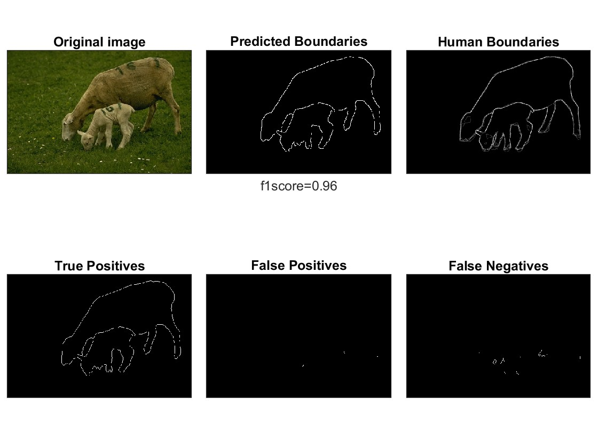

<a id="readme-top"></a>

# Image Segmentation Coursework 

## Table of Contents

- [Project Name](#project-name)
- [Table of Contents](#table-of-contents)
- [Directory Structure](#directory-structure)
- [Getting Started](#getting-started)
  - [Prerequisites](#prerequisites)
  - [Cloning this repository](#cloning-this-repository)
- [Usage](#usage)
- [Contributing](#contributing)
- [License](#license)
- [Acknowledgments](#acknowledgments)

## About the Project

This project was submitted as part of coursework requirements for a computer vision module in my MSc Data Science programme. The task at hand was to implement an image segmentation algorithm to meaningfully separate distinct objects within an image - a key computer vision task. 

While exploring the literature in search of a suitable algorithm, I discovered the Superpixel-based Fast Fuzzy C-Means (SFFCM) clustering technique by Lei and colleagues (2019). They also implemented the algorithm in MATLAB; the source code can be found in their repo [here](https://github.com/jiaxhsust/Superpixel-based-Fast-Fuzzy-C-Means-Clustering-for-Color-Image-Segmentation/tree/master). For my coursework, I used their code with minor modifications to ensure compatibility with the evaluation requirements provided by the module lecturers. The algorithm code can be found in the `fcm_algo` folder. The `eval_code` folder contains code used for evaluating the output of the image segmentation algorithm - these scripts was provided by module organisers for testing and evaluation purposes.

A brief report may be found in the [coursework write-up](./Coursework_write-up_Chin%20Rong%20Ong.pdf). More details on the SFFCM algorithm may be found in the [original paper](https://ieeexplore.ieee.org/document/8584141) by Lei and colleagues.

### Sample output:


<p align="right">(<a href="#readme-top">back to top</a>)</p>

## Directory Structure

image-segmentation-sffcm/
├── +eval_code/                 # code for evaluation of algorithm on images
├── +fcm_algo/                  # source code for sffcm algorithm
├── output/                     # output images, tables, etc.
├── training_images/            # training images and human-labelled boundaries
├── sample_images/              # sample images for testing of algorithm (unlabelled)
├── hyperparameter_tuning.mlx   # script for hyperparameter tuning
├── license.txt                 # license file
├── main.mlx                    # script for running algorithm
└── README.md                   # this file

<p align="right">(<a href="#readme-top">back to top</a>)</p>

## Getting Started

### Prerequisites

- [MATLAB](https://uk.mathworks.com/products/matlab.html) 

### Cloning this repository

To get a local copy of the project, follow these steps:

1. Open your terminal or command prompt.
2. Navigate to the directory where you want to clone the repository.
3. Run the following command:

   ```bash
   git clone https://github.com/crong12/image-segmentation-sffcm.git
   ```

<p align="right">(<a href="#readme-top">back to top</a>)</p>

## License

<p align="right">(<a href="#readme-top">back to top</a>)</p>

## Acknowledgments

<p align="right">(<a href="#readme-top">back to top</a>)</p>

## References

<p align="right">(<a href="#readme-top">back to top</a>)</p>